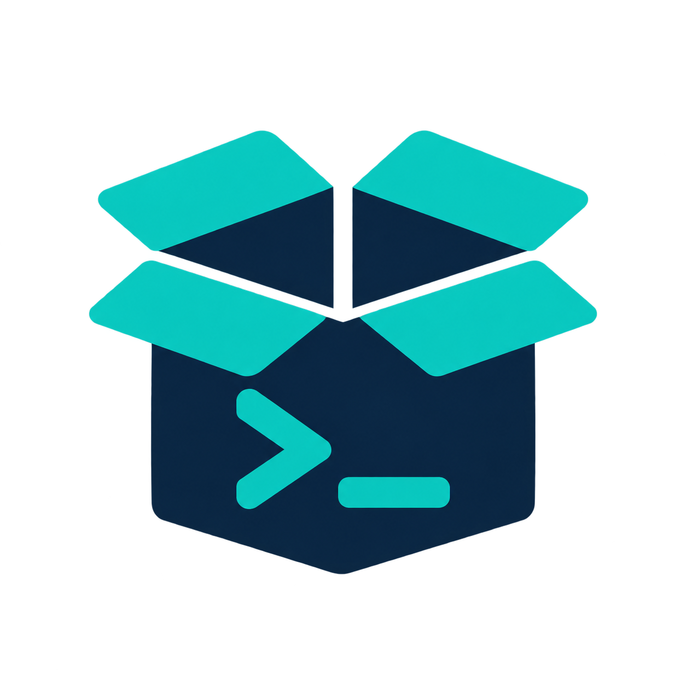

# pkgtui 📦

<p align="center">
  
</p>

[](https://github.com/padovanl/pkgtui/actions/workflows/ci.yml)
[](https://github.com/padovanl/pkgtui/actions/workflows/release.yml)
[](https://github.com/padovanl/pkgtui/releases/latest)
[](https://github.com/padovanl/pkgtui/releases)
[](go.mod)
[](LICENSE)

An **htop-style** terminal UI (TUI) to search, install, remove and upgrade
packages from **apt**, **snap**, **flatpak**, **Homebrew** and **MacPorts**,
in a single dashboard, without having to remember the syntax of any of them.
pkgtui shows a tab for each package manager it finds on the system — Linux
or macOS — so you only ever see the ones you actually have. See
[CHANGELOG.md](CHANGELOG.md) for what's new.


*Searching an **apt** package, its dependency tree (`W`), and the disk-usage metrics dashboard (`M`).*


*Same flow on **snap**, including the channel picker (`c` to cycle stable/candidate/beta/edge).*

## ✨ Features

### 🔍 Browse & search

- **One tab per package manager**: `apt`, `snap`, `flatpak`, `brew`
  (Homebrew) and `macports`, each with its own state (the worlds are never
  mixed together). Only the ones actually installed get a tab, so a Fedora
  box or a Mac isn't cluttered with backends it can't use.
- **Live search**: search packages by name/description (`apt-cache search`,
  `snap find`, `flatpak search`, `brew search`, `port search`).
- **Local filter**: narrow whatever list is currently on screen as you type
  — instant, no external query.
- **Installed / Upgradable / Orphaned**: dedicated views for what's on your
  system, what has an update, and — for the backends that can answer it —
  what nothing needs any more (`apt-get autoremove`, `brew autoremove`,
  `port echo leaves`).
- **Package details**: description, version, dependencies — including
  *reverse* dependencies, so you know what else relies on a package before
  you remove it — or publisher/channels for snap, remote and runtime for
  flatpak.
- **Sort by installed size**: find what's actually eating your disk.
- **Mouse support**: click a tab to switch backend, click a row to select
  it, scroll to navigate.

### ⚡ Act on packages

- **Install/remove/upgrade with confirmation**: every privileged action
  asks for confirmation (`y`/`n`) before running.
- **Live output, without losing the app**: every package-manager command
  runs in a real pseudo-terminal shown in a bordered box inside pkgtui — you
  still get the genuine `sudo` password prompt and any interactive
  dpkg/debconf dialog, but the screen doesn't get handed over. The view
  stays up after the command finishes (green border on success, red on
  failure) until you press a key, so you can actually read the result.
- **Multi-select**: tag several packages and install/remove them in one
  batch action.
- **Upgrade all, with a preview**: `U` fetches and shows exactly which
  packages will change before you confirm, instead of a blind "upgrade
  everything?".
- **Security updates called out**: upgradable packages coming from a
  `-security` repo get a distinct red marker, and the upgrade-all
  confirmation counts them separately.
- **Channel picker**: install a snap from `stable`, `candidate`, `beta` or
  `edge` instead of always defaulting to stable.
- **Hold/pin (apt, flatpak, brew)**: block a package from being touched by
  upgrades (`apt-mark hold`, `flatpak mask`, `brew pin`), with held
  packages marked `[held]` in the list.
- **Changelog viewer (apt)**: see what actually changed in a package
  before upgrading it (`apt-get changelog`).
- **Third-party sources (`P`, apt and flatpak)**: list, add and remove
  apt PPAs and flatpak remotes from inside the TUI — each screen labelled
  in that backend's own words, with the exact command shown before it runs
  and gated behind an explicit warning, since a bad source can break
  updates for the whole system. Adding Flathub is one line here
  (`flathub https://dl.flathub.org/repo/flathub.flatpakrepo`, or just the
  `.flatpakrepo` URL and pkgtui names the remote after it).
- **Install a specific version, or downgrade (`V`, apt)**: pick from every
  version `apt-cache madison` knows about across your configured repos,
  not just the one candidate apt would offer on its own — useful right
  after an upgrade turns out to be the one you wanted to avoid.
- **Revert (`V`, snap)**: snap's own idiomatic undo — restores the
  previous revision's binary *and* its data/config, not just an older
  version number.

### 🧹 Cleanup & insight

These go beyond wrapping package-manager commands — they answer questions
none of these tools (nor any TUI wrapping them) normally surfaces on its
own:

- **Disk cleanup explorer (`K`)**: old kernel packages apt's own
  `autoremove` deliberately leaves behind, leftover config files from
  already-removed packages (`dpkg`'s "rc" state — never cleaned up
  automatically), disabled old snap revisions kept as a rollback safety net
  nobody ever revisits, Homebrew's cached downloads and superseded kegs,
  the inactive port versions MacPorts keeps after every upgrade, and the
  flatpak runtimes no installed app needs any more — for that last one the
  entry hands off to `flatpak uninstall --unused`, which knows the real
  answer and lists exactly what it removes before doing it, rather than
  pkgtui guessing at extensions and base runtimes from the outside. Shows
  total reclaimable space, purge one finding at a time with the same
  confirm-then-run flow as every other privileged action.
- **Dependency tree (`W`)**: whether the selected package was explicitly
  asked for or only pulled in as a dependency, plus a navigable
  `├──`/`└──` tree of what currently depends on it, with a breadcrumb
  trail — drill into any reverse dependency to ask the same question
  about *it*, instead of piping `apt-cache rdepends`, `brew uses` or
  `port dependents` through your own
  head.
- **Backend overlap view (`O`)**: packages installed through *more than
  one* backend at once (Canonical has, at times, silently substituted apt
  packages like Firefox with a snap "transitional" package — this is how
  you'd actually notice; the same app arriving from both apt and flatpak,
  or brew and MacPorts, is just as easy to end up with), and installed
  snaps that haven't been refreshed in 6+ months, using the snap's own
  on-disk file timestamp rather than any locale-dependent text. apt already
  flags upgradable packages; snap has no equivalent signal for "this has
  sat untouched for years," which real-world surveys of installed snaps
  have found is common.
- **Unattended-upgrades dashboard (`A`, apt)**: whether silent background
  upgrades are even enabled, what the last automatic run actually
  touched, and when the next one is scheduled — normally visible only by
  digging through `/var/log/unattended-upgrades/` by hand.
- **Metrics dashboard (`M`)**: installed packages ranked by disk usage as
  a bar chart, for every backend that can report a size — snap has no size
  column of its own in `snap list` and Homebrew has none anywhere, so
  pkgtui measures the installed revision's file (snap) or the keg
  directory (brew) itself. MacPorts reports no size at all, and says so
  rather than guessing.
- **Upgrade conflicts (`X`, apt)**: packages a conservative `apt-get
  upgrade` would leave behind because it needs to install or remove
  something else first — distinct from an explicit hold, which already
  has its own `◆` marker. "Upgrade all" (`U`) already resolves most of
  these on its own (it uses `dist-upgrade`); this is what tells you
  *which* ones and *why*. Also surfaces packages Ubuntu's phased update
  rollout is holding back from this machine, which show up as plainly
  "upgradable" everywhere else but that neither a plain upgrade nor
  `dist-upgrade` will actually touch until the rollout reaches you.
- **Action log (`L`)**: every privileged action run this session, all
  backends together, with a timestamp and success/failure — a running
  record of what you actually did, without digging through shell
  history.

### 🎨 Make it yours

- **11 built-in color themes**: from classic terminal looks (Dracula,
  Nord, Solarized, Gruvbox) to Catppuccin, Tokyo Night, Monokai, Darcula,
  VS Code Dark+ and Ubuntu's own palette. Browse them with `←`/`→` in the
  settings screen — the whole UI re-skins live as you move, no need to
  commit to one just to see it.
- **Rebind any action key**, live, from inside the app — no config file
  editing required (though it's saved to one), with a one-key reset back
  to the defaults if a round of rebinding goes sideways.
- **Remembers where you left off**: backend and view are restored on the
  next launch.

## 📥 Installation

No verification/store required: grab the asset from the [releases
page](https://github.com/padovanl/pkgtui/releases) and install it locally.
The `.deb` and `.snap` both register an application entry and icon, so
pkgtui shows up in your desktop's app launcher (opening in a terminal,
since it's a TUI) if you have one — a headless install just ignores it.

Below, `<version>` means the release number **without** a leading `v` (a
`v0.1.1` tag produces `pkgtui_0.1.1_amd64.deb`, not `pkgtui_v0.1.1_amd64.deb`)
— check the exact asset names on the [latest
release](https://github.com/padovanl/pkgtui/releases/latest) rather than
guessing. The commands use `-f` so curl fails loudly on a wrong URL instead
of silently saving GitHub's "not found" page as if it were the package.

### `.deb` package (Debian/Ubuntu and derivatives)

```bash
curl -fLO https://github.com/padovanl/pkgtui/releases/latest/download/pkgtui_<version>_amd64.deb
sudo apt install ./pkgtui_<version>_amd64.deb
```

### `.snap` package (side-load, no Snap Store)

`pkgtui` needs to invoke `apt`/`snap` on the host system, so the package
uses `classic` confinement:

```bash
curl -fLO https://github.com/padovanl/pkgtui/releases/latest/download/pkgtui_<version>_amd64.snap
sudo snap install --dangerous --classic pkgtui_<version>_amd64.snap
```

### Standalone binary (any Linux distro with apt, snap and/or flatpak)

```bash
curl -fLO https://github.com/padovanl/pkgtui/releases/latest/download/pkgtui_<version>_linux_amd64.tar.gz
tar -xzf pkgtui_<version>_linux_amd64.tar.gz
sudo mv pkgtui /usr/local/bin/
```

### Homebrew (macOS, and Linuxbrew)

```bash
brew tap padovanl/pkgtui https://github.com/padovanl/pkgtui
brew install --cask pkgtui
```

Every release publishes a Homebrew cask, so `brew upgrade --cask pkgtui`
keeps it current like anything else you installed with brew. The explicit
URL in the `tap` line is needed because the tap lives in this repository
rather than a separate `homebrew-pkgtui` one — Homebrew only infers the
URL for repos named that way.

The cask covers Apple Silicon, Intel Macs and Linuxbrew, and clears the
Gatekeeper quarantine attribute itself, which matters because these
binaries aren't notarized. macOS still requires one manual approval on
the very first launch, since the binary is unsigned — not required again
after that:

1. Right after `brew install --cask pkgtui` finishes, macOS reports
   *"pkgtui" Not Opened* since the binary isn't notarized — click
   **Done** (not Move to Bin), it's already on your `PATH`.

   

2. Open **System Settings → Privacy & Security**, scroll down to the
   note that *"pkgtui" was blocked to protect your Mac*, and click
   **Allow Anyway**.

   

3. Open a terminal and run `pkgtui` again — an *Open "pkgtui"?* prompt
   appears, click **Open Anyway**, then enter your password when asked.
   `pkgtui` starts normally from then on.

   

(Thanks to [@Sk8teb0arder](https://github.com/Sk8teb0arder) for walking
through this and sharing the screenshots.)

### macOS without Homebrew

Use `darwin_arm64` on Apple Silicon, `darwin_amd64` on Intel:

```bash
curl -fLO https://github.com/padovanl/pkgtui/releases/latest/download/pkgtui_<version>_darwin_arm64.tar.gz
tar -xzf pkgtui_<version>_darwin_arm64.tar.gz
sudo mv pkgtui /usr/local/bin/
```

`curl` doesn't set the quarantine attribute, so this works as is. If you
grabbed the archive with a browser instead, clear it with
`xattr -d com.apple.quarantine /usr/local/bin/pkgtui` — or just use the
cask above, which handles it for you.

### From source

```bash
git clone https://github.com/padovanl/pkgtui.git
cd pkgtui
go build -o pkgtui .
sudo mv pkgtui /usr/local/bin/
```

## ⌨️ Usage

```bash
pkgtui
```

| Key         | Action                                     |
| ----------- | ------------------------------------------- |
| `←` / `→`   | Switch backend (one tab per package manager found) |
| `tab`       | Switch view (Installed / Upgradable / Orphaned\* / Search) |
| `/`         | Search the backend's full catalog (then `enter` to run it) |
| `f`         | Filter the packages currently shown, live as you type (`enter` to keep it, `esc` to close without filtering) |
| `↑`/`↓`, `j`/`k` | Navigate the list (mouse wheel and clicks work too) |
| `enter`     | Show details for the selected package       |
| `space`     | Tag/untag the selected package for a batch action |
| `i`         | Install the selected package, or all tagged packages |
| `d`         | Remove the selected package, or all tagged packages |
| `u`         | Upgrade the selected package                |
| `U`         | Upgrade **all** packages (shows what will change first) |
| `S`         | Sort the current view by installed size     |
| `c`         | Cycle the install channel (while confirming a snap install) |
| `H`         | Hold/unhold the selected package (apt, flatpak, brew) |
| `C`         | View the selected package's changelog (apt) |
| `P`         | Manage third-party sources: PPAs (apt), remotes (flatpak) |
| `s`         | Sync the cache (`apt-get update`, `flatpak update --appstream`, `brew update`, `port selfupdate`; no-op on snap) |
| `K`         | Disk cleanup explorer: old kernels, leftover configs, disabled snap revisions, brew cache, inactive ports |
| `W`         | Why is the selected package installed (manual vs. dependency, reverse-dep tree; apt, brew, macports) |
| `A`         | Unattended-upgrades status (apt)            |
| `O`         | Backend overlap view: packages installed more than once, stale snaps |
| `V`         | Install a specific version of the selected package / downgrade (apt); revert to the previous revision (snap) |
| `M`         | Metrics dashboard: installed packages ranked by disk usage |
| `X`         | Upgrade conflicts: packages a plain upgrade would keep back, or Ubuntu's phased rollout is holding back (apt) |
| `L`         | Action log: what's run this session, and whether it succeeded |
| `y` / `n`   | Confirm / cancel an action                  |
| `esc`       | Go back                                     |
| `,`         | Open settings (theme, keybindings)          |
| `?`         | Toggle the in-app help screen (full keybinding list) |
| `ctrl+l`    | Force a full screen redraw (fixes a stale/glitched display, same as in vim/bash/htop) |
| `q`         | Quit                                        |

\* Orphaned appears for the backends that can answer the question: apt
(`apt-get autoremove`), Homebrew (`brew autoremove`) and MacPorts (`port
echo leaves`).
All key bindings above except navigation and the y/n/esc confirm keys can be
remapped from the settings screen (`,`).

Actions that change the system (install, remove, upgrade) run with `sudo`
where the package manager expects it — apt, snap and MacPorts — and
deliberately *without* it for Homebrew (which refuses to run as root) and
flatpak (which asks polkit for authorization on its own). `sudo` is
skipped automatically if you're already root, e.g. inside a container.
Either way the command is
attached to a real pseudo-terminal, shown live in a box inside pkgtui.
Keystrokes go straight to the command, so the password prompt and any
interactive dpkg/debconf dialog work exactly as they would from the
command line — `ctrl+c` interrupts the running command rather than
pkgtui itself. The view stays open after the command finishes so you can
read the result; press any key to return.

Every package row starts with a status symbol, also shown as a legend right
under the header and in the `?` help screen:

| Symbol      | Meaning           |
| :---------: | ----------------- |
| `●`         | Installed          |
| `▲`         | Installed, upgrade available |
| `▲` (red)   | Installed, security update available |
| `○`         | Not installed      |
| `◆`         | Held: upgrades blocked (`H` to toggle) |

## ⚙️ Configuration

Settings (theme, rebound keys) and the last-used view live in
`~/.config/pkgtui/config.json`, written by the settings screen (`,`) — there's
normally no need to edit it by hand, but it's plain JSON if you want to.

## ✅ Requirements

- At least one supported package manager: `apt`/`dpkg`, `snapd`, `flatpak`,
  Homebrew or MacPorts. Having only some of them is the normal case — each
  one found gets a tab, the rest simply aren't shown. With none of them
  installed, every backend is listed and each says it isn't available, so
  the window still tells you what pkgtui supports.
- Linux or macOS (Apple Silicon and Intel). Everything pkgtui does is
  shelling out to the package managers themselves, so there's nothing
  platform-specific beyond which of them exist on the machine.
- `sudo` configured for the current user, for privileged operations with
  apt, snap and MacPorts. Homebrew and flatpak handle their own
  privileges and are never run through `sudo`.
- Go 1.24+ only if building from source (fetching Go modules needs
  internet; the compiled binary itself doesn't).
- Internet access for anything that reaches an actual package repository
  or catalog — search, install, upgrade, changelog. Browsing what's
  already installed or upgradable works fully offline. pkgtui makes no
  network calls of its own; this is exactly the same requirement the
  package managers have on their own.
- A terminal that reports 256-color or truecolor support. A bare
  `TERM=xterm` (no `-256color` suffix) gets detected as a 16-color
  terminal, which downsamples every theme's colors to the nearest basic
  ANSI color and can make some of them hard to tell apart. Minimal
  Docker/SSH sessions are the usual culprit — `export TERM=xterm-256color`
  (or `COLORTERM=truecolor` if the real terminal supports it) fixes it.

## 🤝 Contributing

Pull requests are welcome — see [CONTRIBUTING.md](CONTRIBUTING.md) for the
branch policy, local setup, code style, and the release process. Short
version: open PRs against `develop`, not `main`, and run
`gofmt -l . && go vet ./... && go test ./...` before pushing.

## 📄 License

MIT — see [LICENSE](LICENSE).
